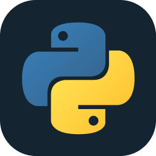
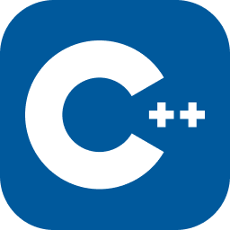
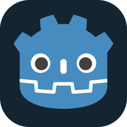
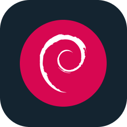
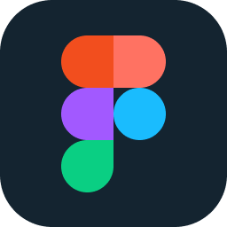
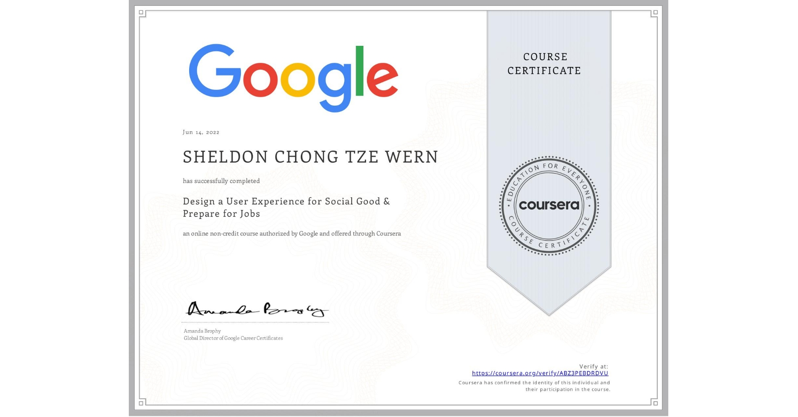

## Hi there, I'm Sheldon Chong 👋
### About me
I am a 18 y.o. multi-talented Game Developer, Coder, Digital Artist, YouTuber, Animator, Speaker, Author, Musician, Entrepreneur & Changemaker with a mission to inspire creativity and transform mindsets. I have been conducting workshops on cartooning, comic drawing, coding, 2D Animation and other creative workshops for the past 9 years. 

___

### Youtube
Alongside my brother, we actively manage a YouTube Channel called CyberLegends Animations, which currently has amassed a 895k subscribers, and 179 million views. My role in this channel involves not only creative areas like animation, illustration and script-writing, but also automations, and software scripting. I actively build tools to assist with creating animations and translating them to other languages.

	
	 As at 6.3.2025 

### Socials

 

___

## Skills

**Coding Languages**

 

 

**Database**

 

**Tools**

 

 

**Operating systems**

 

 

**Design/illustration**

 

 

___

## Projects that I've completed in the 42 Core program
I'm currently studying at <a href="https://42kl.edu.my/">42 Kuala Lumpur</a>, which is under Sunway Education Group.
As part of the 42's Core Program, I have worked on a number of coding projects that cover various fields of computer science.

<table>
  <tr>
    <th>Project</th>
    <th>Project Description</th>
    <th>Concepts Covered</th>
  </tr>
  <tr>
    <td><a href="https://github.com/Sheldon-Chong/Libft"><strong>libft</strong></a></td>
    <td>Creating a library of essential functions for every-day programming use</td>
    <td>pointers, memory allocation, headers, linking files & static libraries, makefile</td>
  </tr>
  <tr>
    <td><a href="https://github.com/Sheldon-Chong/get_next_line"><strong>Get_next_line</strong></a></td>
    <td>Create a program that retrieves the next line of a given file, which is a convenient utility to parse files</td>
    <td>File descriptors, read/write operations, static variables</td>
  </tr>
  <tr>
    <td><a href="https://github.com/Sheldon-Chong/ft_printf"><strong>ft_printf</strong></a></td>
    <td>Recreating the printf function from C, which allows to print a message with format specifiers</td>
    <td>Variadic arguments, C printf behaviour</td>
  </tr>
  <tr>
    <td><a href="#"><strong>born2beroot</strong></a></td>
    <td>Setting-up, running and operating a Linux distribution in a virtual machine using Virtual Box</td>
    <td>Operating systems & kernels, users & super-users, groups, daemons & background processes, software protection, file systems and partitioning</td>
  </tr>
  <tr>
    <td><a href="https://github.com/Sheldon-Chong/pipex"><strong>pipex</strong></a></td>
    <td>Create a program that will execute a series of commands, piping the output of one to the next</td>
    <td>Pipes & inter-process communication, file descriptors and redirection, process forking</td>
  </tr>
  <tr>
    <td><a href="https://github.com/Sheldon-Chong/push_swap"><strong>pushswap</strong></a></td>
    <td>Creating a sorting algorithm that will sort a given array of numbers ascending in the least amount of steps</td>
    <td>Sorting-algorithms, linked lists, bit-wise operations and bit-shifting</td>
  </tr>
  <tr>
    <td><a href="https://github.com/Sheldon-Chong/so_long_linux_compatible.git"><strong>so_long</strong></a></td>
    <td>Create a 2D top-down interactive videogame. The first graphics project of the Core Program</td>
    <td>2D Graphics rendering</td>
  </tr>
  <tr>
    <td><a href="https://github.com/Sheldon-Chong/Philosophers"><strong>philosophers</strong></a></td>
    <td>Create a program that will run, and coordinate threads as they access resources</td>
    <td>Multi-threading, mutex locks, data races, process forking, semaphores</td>
  </tr>
  <tr>
    <td><a href="https://github.com/Sheldon-Chong/minishell"><strong>Minishell</strong></a></td>
    <td>Creating a program that imitates bash</td>
    <td>Bash behaviour, Abstract-Syntax-Tree, Signals</td>
  </tr>
  <tr>
    <td><a href="https://github.com/Sheldon-Chong/cub3D"><strong>Cub3D</strong></a></td>
    <td>Create a 3D ray-caster with player movement and other interactive components</td>
    <td>Ray-casting and 3D rendering, collisions, textures</td>
  </tr>
  <tr>
    <td><a href="https://github.com/Sheldon-Chong/netpractice.git"><strong>Netpractice</strong></a></td>
    <td>Learning and practicing networks and networking, IP addresses, subnet masks and physical components involved in networks</td>
    <td>Networks, IP's & subnet masks, routers & switches, overlapping IP's</td>
  </tr>
  <tr>
    <td><a href="#"><strong>C++ Modules 0-4</strong></a></td>
    <td>Completing a series of C++ projects, each aimed at teaching different topics</td>
    <td>Streams, OOP, Member access modifiers, Inheritance, Overloading, Method Overriding, Operator Overloading, Polymorphism</td>
  </tr>
</table>

___

### 🎮 Games
I've been developing video games throughout the past 8 years. I combine my coding skills with my digital art skills and creative ideas into these videogames. I participated in international and local coding and game development competitions and have won top spots. 

	

		<strong>Some of the games I've developed</strong>
	

	

		 
		</img>
		</img>
		 
		</img>
		</img>
	

___
### 🔍 Articles & Insights 
I have written several extensive articles regarding, compiling knowledge I have gathered via research

<table>
	<tr>
		<td width="300"></td>
		<td>
A few months ago, I wrote myself some notes on Netpractice as I was doing research on the subject. However as my knowledge grew, so did the rabbit-hole that was networking. There were a lot of great resources out there, but I didn't find source that effectively provided the entire picture for networking. Compiling my findings, I spent 2-weeks refining this guide.

This guide aims to give a full picture on the subjects concerning netpractice from scratch, in a manner as digestible as I could make it. Many points brought up will be supported by graphics and visuals that I illustrated. 

It covers netpractice topics such as IP addresses, CIDR and subnet calculations, and Networking devices, plus additional concepts such as ARP requests, MAC addresses, DNS and DHCP.
		</td>
	</tr>
 	<tr>
  		<td width="300"></td>
  	<\tr>
</table>

___ 
### 🏆 Awards
I've won numerous awards in competitions related to coding and STEM. 
 

<strong>Coding and Game Development:</strong>

Have won numerous local and international awards and competitions in various areas such as Game Development, Coding and STEM. Among them are:
- Game: “Jom Mamak!” Won the Gold Award and Jury Award in the Creative @ Schools Level Up Game Development competition, organised by Malaysian Development Economy Corporation.
- First Place Winner in the Young Educators Challenge 2021, and won a full scholarship to Sunway College
- Game: “Cephion”. Won the Grand Prize in the Dell Technologies Game Design Challenge 2021 (Out of 300 entries internationally, mainly from the USA). 
- Game: “Smartopia City 2". Won Champion in the Codemao International Creative Coding Competition 2020
- Game: “Virus Defense” – Codemao International Creative Coding Competition 2020 (selected to enter the finals in which I won Champion)
- Game: “Smartopia City 2”. Won the Silver Award in the International Scratch Coding Competition 2020 (World's largest virtual coding competition with 4158 participants)
- Game: “Smartopia City 1”. Won the Top Coder Award in the WeCode International Competition 2020 (Out of 200+ entries) (Game was showcased in Shenzhen, China)
- First Runner Up, Young Extrepreneur X-Factor 2019 (Teens challenge) and won an international school scholarship.

<!--
**Sheldon-Chong/Sheldon-chong** is a ✨ _special_ ✨ repository because its `README.md` (this file) appears on your GitHub profile.

Here are some ideas to get you started:

- 🔭 I’m currently working on ...
- 🌱 I’m currently learning ...
- 👯 I’m looking to collaborate on ...
- 🤔 I’m looking for help with ...
- 💬 Ask me about ...
- 📫 How to reach me: ...
- 😄 Pronouns: ...
- ⚡ Fun fact: ...
I have authored and published 2 children science-fiction storybooks. which were sold at Borders Malaysia. I also do digital art commissions. I am an alumni of the Tuanku Bainun Young Changemaker Awards and had won runner-up in the Young Entrepreneur X-Factor 2019 (Teen’s Challenge). I run my own talk show Treehouse Teenz Talk, interviewing local and international entrepreneurs to inspire people to be conscious changemakers.

Together with my 15 y.o. brother, Emerson, we manage our animations YouTube Channel, CyberLegends Animations that we started during the MCO 1.0 in 2020. It currently has 500K+ subscribers and 119 million+ views (and growing) https://www.youtube.com/CyberLegendsAnimations

-->

### Google UX Design 

I completed a hands-on 6-module course on UX design that covers creating interactive low and high-fidelity wireframes prototypes for Mobile, Desktop and Web interfaces using tools like Figma and Adobe XD, the UX design cycle, conducting usability studies and iterative design, and design concepts like layout, typography, iconography and color.

1. [Certificate: Start the UX Design Process: Empathize, Define, and Ideate](https://coursera.org/share/ede072582e22b6e35d7fea4c6c17b19d)
2. [Certificate: Build Wireframes and Low-Fidelity Prototypes](https://coursera.org/share/942113e76480a6bf046078d24fb74be3)
3. [Certificate: Conduct UX Research and Test Early Concepts](https://coursera.org/share/ec1bc6bfe13a939163052ebaac379bc1)
4. [Certificate: Create High-Fidelity Designs and Prototypes in Figma](https://coursera.org/share/38f0e359a782a4d3852df4c085810d91)
5. [Certificate: Build Dynamic User Interfaces (UI) for Websites](https://coursera.org/share/1b1f990a8da5506f72b476ecdf020dce)
6. [Certificate: Design a User Experience for Social Good & Prepare for Jobs](https://coursera.org/share/c90a4f37bc1d20c1feb090b353022807)
