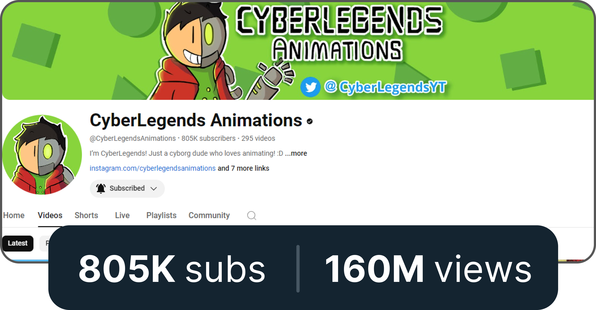

## Hi there, I'm Sheldon Chong 👋
### About me
I am a 17 y.o. multi-talented Game Developer, Coder, Digital Artist, YouTuber, Animator, Speaker, Author, Musician, Entrepreneur & Changemaker with a mission to inspire creativity and transform mindsets. I have been conducting workshops on cartooning, comic drawing, coding, 2D Animation and other creative workshops for the past 8 years. My younger brother and I manage a YouTube Channel called CyberLegends Animations, which currently has amassed a 800k subscribers and over 150 million views (As at 6 Oct 2023).

### Youtube

	

Alongside my brother, I currently run the YouTube channel CyberLegends Animations.

### Socials

 

___
## Skills

**Coding Languages**

 

 

**Database**

 

**Tools**

 

 

**Operating systems**

 

 

**Design/illustration**

 

 

___

## Core program

| **Project**       | Project                                                	  	| Concepts covered 	|
| ----------------- | ---------------------------------------------------------------------------------------------------------------------------	| ----- |
| **libft**     	| Creating a library of essential functions for every-day programming use														| pointers, memory allocation, headers, linking files & static libraries, makefile
| **Get_next_line** | Create a program that retrieves the next line of a given file, which is a convenient utility to parse files					| File descriptors, read/write operations, static variables
| **ft_printf**     | Recreating the printf function from C, which allows to print a message with format specifiers									| Variadic arguments
| **born2beroot**   | setting-up, running and operating a Linux distribution in a virtual machine using Virtual Box									| Operating systems & kernels, users & super-users, groups, daemons & background proceses, software protection 
| **pipex**         | Create a program that will execute a series of commands, piping the output of one to the next									| Pipes & inter-process communication, file descriptors and redirection, process forking
| **pushswap**      | Creating a sorting algorithm that will sort a given array of numbers ascending in the least amount of steps					| Sorting-algorithms, linkedlists, bit-wise operations and bit-shifting
| **so_long**       | Create a 2D top-down interactive videogame. The first graphics project of the Core Program									| 2D Graphics rendering
| **philosophers**  | Create a program that will run, and coordinate threads as they access resources												| Multi-threading, mutex locks, dataraces, process forking, semaphores
| **Minishell**   	| Creating a program that imitates bash																							| Bash behaviour, Abstract-Syntax-Tree, Signals
| **Cub3D**         | Create a 3D ray-caster with player movement and other interactive components.													| Ray-casting and 3D rendering, collisions, textures
| **Netpractice**   | Learning and practicing networks and networking, IP addresses, subnet masks and physical components involved in networks		| Networks, IP's & subnet masks, routers & switches, overlapping IP's

___

### 🎮 Games
I've been developing video games throughout the past 8 years. I combine my coding skills with my digital art skills and creative ideas into these videogames. I participated in international and local coding and game development competitions and have won top spots. 

	

		<strong>Some of the games I've developed</strong>
	

	

		 
		</img>
		</img>
		 
		</img>
		</img>
	

I have authored and published 2 children science-fiction storybooks. which were sold at Borders Malaysia. I also do digital art commissions. I am an alumni of the Tuanku Bainun Young Changemaker Awards and had won runner-up in the Young Entrepreneur X-Factor 2019 (Teen’s Challenge). I run my own talk show Treehouse Teenz Talk, interviewing local and international entrepreneurs to inspire people to be conscious changemakers.

Together with my 15 y.o. brother, Emerson, we manage our animations YouTube Channel, CyberLegends Animations that we started during the MCO 1.0 in 2020. It currently has 500K+ subscribers and 119 million+ views (and growing) https://www.youtube.com/CyberLegendsAnimations

___ 
### 🏆 Awards
I've won numerous awards in competitions related to coding and STEM. 
 

<strong>Coding and Game Development:</strong>

Have won numerous local and international awards and competitions in various areas such as Game Development, Coding and STEM. Among them are:
- Game: “Jom Mamak!” Won the Gold Award and Jury Award in the Creative @ Schools Level Up Game Development competition, organised by Malaysian Development Economy Corporation.
- First Place Winner in the Young Educators Challenge 2021, and won a full scholarship to Sunway College
- Game: “Cephion”. Won the Grand Prize in the Dell Technologies Game Design Challenge 2021 (Out of 300 entries internationally, mainly from the USA). 
- Game: “Smartopia City 2". Won Champion in the Codemao International Creative Coding Competition 2020
- Game: “Virus Defense” – Codemao International Creative Coding Competition 2020 (selected to enter the finals in which I won Champion)
- Game: “Smartopia City 2”. Won the Silver Award in the International Scratch Coding Competition 2020 (World's largest virtual coding competition with 4158 participants)
- Game: “Smartopia City 1”. Won the Top Coder Award in the WeCode International Competition 2020 (Out of 200+ entries) (Game was showcased in Shenzhen, China)
- First Runner Up, Young Extrepreneur X-Factor 2019 (Teens challenge) and won an international school scholarship.

<!--
**Sheldon-Chong/Sheldon-chong** is a ✨ _special_ ✨ repository because its `README.md` (this file) appears on your GitHub profile.

Here are some ideas to get you started:

- 🔭 I’m currently working on ...
- 🌱 I’m currently learning ...
- 👯 I’m looking to collaborate on ...
- 🤔 I’m looking for help with ...
- 💬 Ask me about ...
- 📫 How to reach me: ...
- 😄 Pronouns: ...
- ⚡ Fun fact: ...
-->
